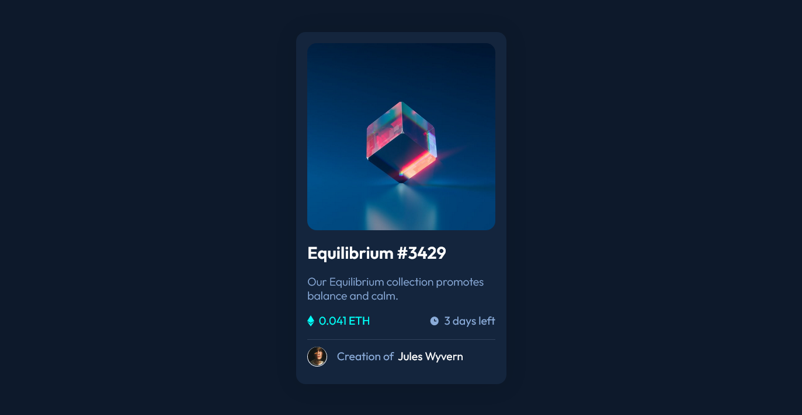

# Frontend Mentor - NFT preview card component solution

This is a solution to the [NFT preview card component challenge on Frontend Mentor](https://www.frontendmentor.io/challenges/nft-preview-card-component-SbdUL_w0U). Frontend Mentor challenges help you improve your coding skills by building realistic projects. 

- Solution URL:(https://a-n-i-e.github.io/Frontend-Mentor---NFT-preview-card-component-solution/)

### Built with

- Semantic HTML5 markup
- CSS custom properties
- Flexbox
- Mobile-first workflow

I learnt how to resize images better with css
Better use of flexbox too

I want to still improve on writing clean css
Did a lot of tweeks -_- but its part of the learning process "~"

- Frontend Mentor - [@A-n-i-e](https://www.frontendmentor.io/profile/A-n-i-e)
